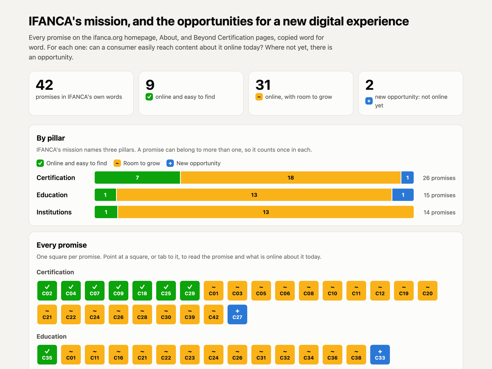
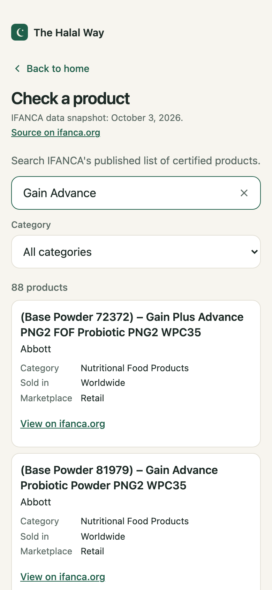
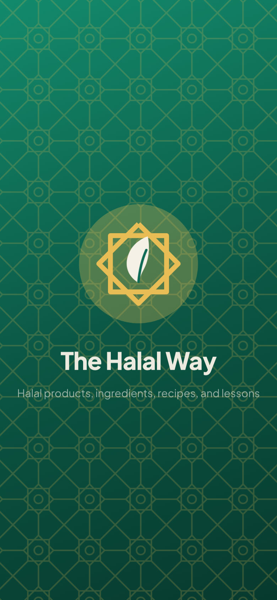
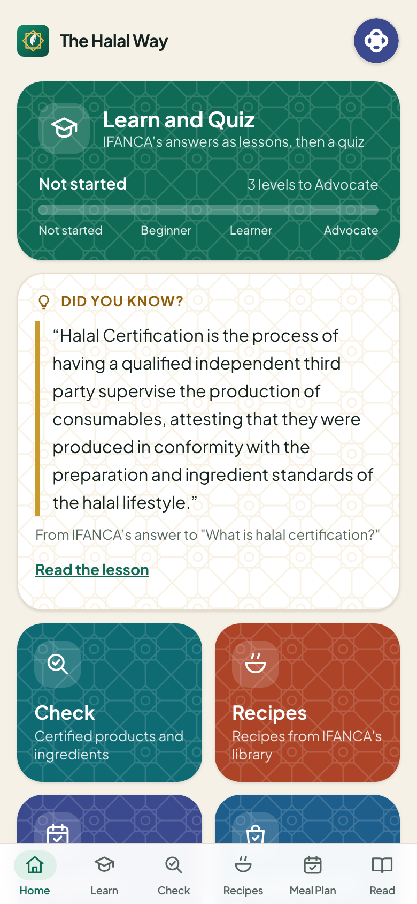
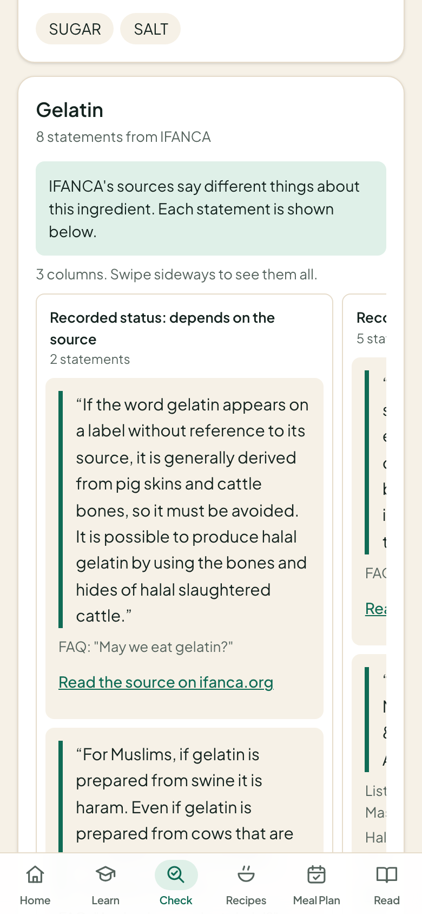
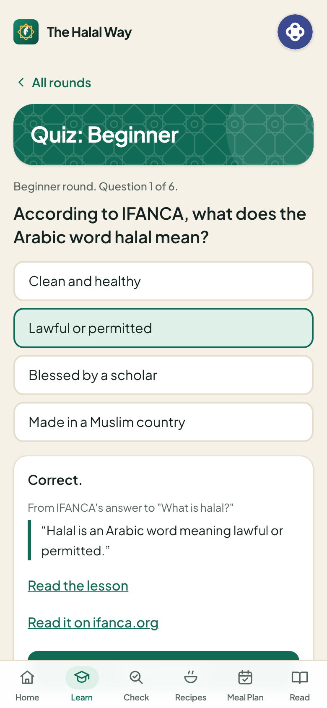
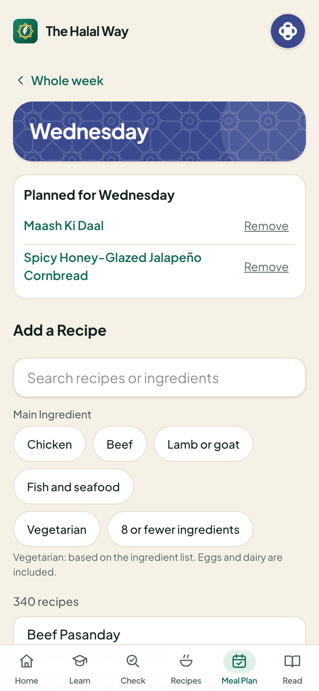
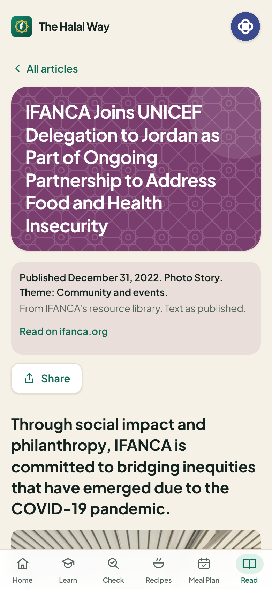
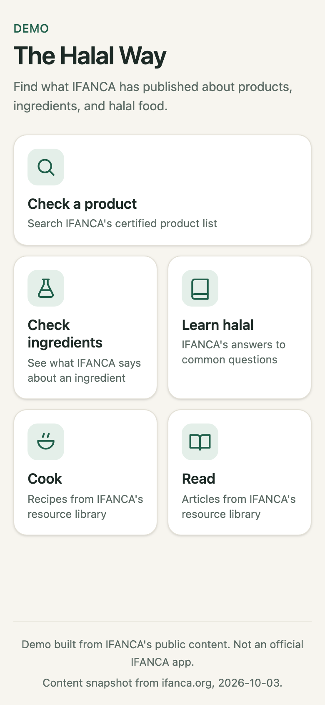
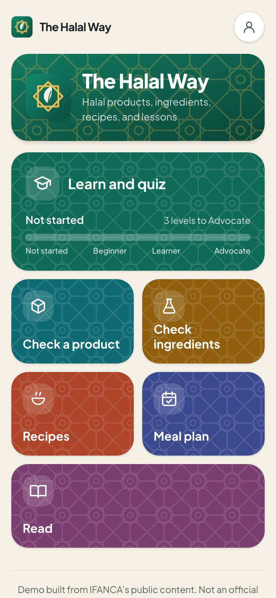

# Building a new digital experience with AI

**How one builder turned IFANCA's public content into a consumer app in a day, by using AI in a systematic way.**

- Live app: https://the-halal-way.vercel.app
- Demo built from IFANCA's public content. Not an official IFANCA app.

---

## What you will take away

1. AI can now build real things, fast. This app went from an idea to a live app in one day.
2. The speed comes from a **system**, not from clever prompts: clear rules, small steps, and checking every result.
3. Building software is where discipline matters most. But the same pattern works for any work: a report, a guide, a training, a review.

---

## The team: one builder and one AI assistant

**The builder** (a person):
- Decides what to make and why.
- Writes instructions in plain English.
- Reviews every result and says what to change.

**The AI assistant** (Claude Code):
- Reads files and websites.
- Writes, builds, and tests.
- Writes down every decision it makes on its own.

> **New word: AI assistant.** An AI that can work inside a project: read, write, run, and check its own work, while the builder steers.

---

## The starting point: IFANCA's mission

> "IFANCA is an organization dedicated to promoting halal through certification, education, and the creation and support of institutions."
>
> ifanca.org

> "IFANCA’s vision is to ensure everyone has access to the halal products and services that let them live a secure, satisfied life."
>
> ifanca.org

The question we asked: **what would a new digital experience for consumers look like, built from what IFANCA already publishes?**

---

## Step 1: Set the rules

Before any work, the builder wrote a one-page rulebook. The AI reads it at the start of every session.

The most important rules:
1. Read only public pages, slowly and politely.
2. Never invent content. Everything points back to its source page.
3. Never state a halal ruling. Record what IFANCA says, word for word.
4. Show that the app is a demo, not an official IFANCA app.

> **New word: CLAUDE.md.** The project rulebook. Like the house rules you give a new team member on day one, so you never have to repeat them.

**Why it matters:** these rules held on every screen the AI built, without being repeated.

---

## Step 2: Read the website

The AI made a careful copy of everything a visitor can reach on ifanca.org.

- 13,662 items read, including 11,642 certified products, 1,115 library items, 172 news posts, 75 magazine issues, and 26 FAQs.
- One page per second, so the website is never strained.
- Every page saved once, with its address and the date.

**A nice moment:** the AI's first name for its reader, "IFANCA-AI-Session-Crawler", was turned away by ifanca.org's own rules for automated visitors. The AI noticed with an automatic check before reading a single page, and picked a new name.

> **New word: Crawl.** Visiting every page of a website with a program and saving a copy, like photocopying every page of a binder.

---

## What we found: IFANCA's library is rich

**Nearly 30 years of publishing.**
- 1,115 library items, from 1998 to 2026.
- Steady output: 290 items in 2010 to 2014, 276 in 2015 to 2019, 295 in 2020 to 2024, and 55 so far in 2025 and 2026.
- 350 items published since 2020.

**What the library covers.**
- Recipes: 352
- Health and nutrition: 224
- Community and events: 78
- Industry and certification: 69
- Ingredients: 48
- Halal basics: 26
- Editorials, features, and other: 318

(Topics were sorted by simple keyword rules, so the counts are close, not exact.)

**Ingredient knowledge.**
- IFANCA has published guidance on 99 ingredients, in 147 statements, across its FAQs and two ingredient guides for consumers.
- The most discussed: artificial and natural flavors (14 statements), mono and diglycerides (9), and gelatin (8).

**Three opportunities in the data.**
1. **A fresh starting point for beginners.** Most of the 26 "halal basics" items were written before 2010. The 26 FAQ answers explain the basics clearly, and can become short lessons.
2. **Ingredient guidance in one place.** It is spread across FAQs and guides from 2011 and 2012. Consumers could look it up in seconds.
3. **Recipes for everyday life.** 352 recipes in the library, 136 of them since 2020. 340 are complete enough to cook from in an app, ready to become a meal plan.

---

## Step 3: From mission to opportunities

The AI copied every promise from IFANCA's homepage, About, and Beyond Certification pages, word for word. 42 promises.

For each one, it asked: **can a consumer easily reach content about this online today?**

- **Certification** is IFANCA's strongest online pillar. The certification process and the full list of certified products are easy to reach.
- **Education** and **institutions** have the most room to grow online. That is where a new consumer experience can add the most.

---

## Step 4: Walk in the consumer's shoes

The AI walked through the website as three real people, step by step, and noted each opportunity.

1. **A consumer in a grocery store, on a phone.** "Is this product certified?" Opportunity: product search in your pocket, a clear message when a product is not on the list, and IFANCA's guidance on the ingredients on the label.
2. **A parent.** "Help me explain halal to my child." Opportunity: a simple starting point, "What is halal?", and a fun way to learn.
3. **A food company.** "Should we get certified?" Opportunity: a future experience for businesses. (Not part of this consumer app.)

> **New word: User journey.** One real person trying to get one thing done, step by step. It shows exactly where a better experience can help.

**Every feature in the app traces back to one of these journeys.**

---

## Step 5: Teach the AI a way of working

The builder wrote four short recipe cards. The AI follows the same four, in the same order, for every feature.

1. **Journey to spec:** write down what the feature must do.
2. **Spec to plan:** break it into small steps.
3. **Build:** one step at a time, saving after each.
4. **Test:** a robot uses the app and checks every point.

> **New word: Skill.** A recipe card the AI follows for one kind of task. Written once, reused every time. Same steps, same quality, every time.

**Why it matters:** this is how a builder stays in control. The AI is fast. The skills make it consistent.

---

## Step 6: One journey, start to finish

**The consumer in the grocery store: "Is this product certified?"**

### 6a. The spec: what "done" means

The goal, in the consumer's words:

> "I am in a store and I want to see if this product is on IFANCA's certified list."

Some of the checks the feature must pass:
- Search by product name, company, or category.
- The category filter really filters (Cheese shows exactly 258 products).
- Results update instantly on a phone.
- A product that is not found shows: "Not in IFANCA's published list. This does not mean it is not certified or not halal."

> **New word: Spec.** A short page that says what a feature must do, before anything is built. Like an architect's brief.

### 6b. The plan: small steps

1. Set up the screen.
2. Add search, the category filter, and results.
3. Add the "not found" message and check the phone layout.
4. (Added after testing) Make a small link easier to tap.

### 6c. The build: one save point per step

Each step was saved as a checkpoint, with a note. If anything goes wrong, you go back one step, not to the start.

> **New word: Commit.** A saved checkpoint of the work, with a short note about what changed.

### 6d. The test: a robot checks every point

A robot tester used the app like a person: it tapped, typed, and read the screen, then took a screenshot for each check.

**On the first run it found two problems:**
- A link was too small to tap easily on a phone. The AI fixed it as a new step.
- One check was written wrongly. The report said so honestly, and the check was corrected.

> **New word: Test.** A program that uses the app like a person and reports pass or fail for each point in the spec.

---

## Step 7: Ship it

To publish a new version, the builder types one short command: **/ship**

It runs the same steps every time:
1. Build the app.
2. Run a quick robot check of the whole app.
3. **Stop if anything fails.**
4. Save the work.
5. Publish it to the live address.
6. Check the QR code still points to the right place.
7. Run the robot check again on the live app.

**Twice, /ship stopped itself** because a check failed, and nothing broken reached the live app.

> **New word: Slash command.** A shortcut, starting with "/", that runs a fixed list of steps. Safety checks cannot be skipped by accident.

> **New word: Ship (deploy).** Publishing a new version so people can use it.

---

## What we built: The Halal Way

A phone app that installs on the home screen and works offline.

- **Learn and Quiz:** IFANCA's 26 FAQ answers as short lessons, starting with "What is halal?", and a quiz in three levels.
- **Did You Know:** one sentence from IFANCA each day.
- **Check:** search 11,642 certified products, or check ingredients by typing, pasting, or **taking a photo of the label**. Where IFANCA's own sources say different things about an ingredient, every statement is shown side by side.
- **Recipes:** 340 recipes, with filters including vegetarian.
- **Meal Plan and Shopping List:** plan the week, and get one combined shopping list.
- **Read:** 763 IFANCA articles, 761 of them readable in full inside the app.
- **Room Leaderboard:** play the quiz together and see scores live.

---

## Step 8: Listen and improve

The first version was not the final one. The owner tried it, wrote feedback in plain English, and the AI ran the same skills again. Six rounds, all in the same day.

**Real feedback the builder typed:**
- "It almost looks like a corporate manual than an interactive consumer app."
- "The design should have islamic geometric aesthetics."
- "When I go to quiz it ask me to login or signup ... Without name and avater leaderboard has no meaning."
- "It should be a splash screen which some nice animation."

First version, after the first round of feedback, and today.

> **New word: Build log.** The diary of every decision the AI made on its own, with the reason. The builder reviews it, and the AI uses it to pick up where it left off.

---

## The guardrails

What the AI was never allowed to do, on any screen:
1. State a halal ruling of its own. It only quotes IFANCA, word for word, with a link to the source.
2. Change IFANCA's words. Lessons, recipes, and articles are shown as published.
3. Say "not halal" about anything missing. It shows one fixed, careful message instead.
4. Use IFANCA's logo or the Crescent-M mark. The logo and patterns are original.
5. Hide that it is a demo. Every screen says "Not an official IFANCA app."

**The robot tester checks most of these rules on every run:** the fixed message, the footer, and IFANCA's words matching the source exactly.

---

## By the numbers

- **1** builder and **1** AI assistant
- **About 9 hours** from the first save point to the version you see today. The first live version took about an hour after the app was set up.
- **13,662** items read from ifanca.org
- **42** promises, **3** journeys, **3** opportunities in the library data
- **6** skills and **1** slash command
- **13** specs, one for each feature and each round of changes
- **161** automated checks on the app and **35** on the leaderboard database, all passing
- **9** releases to the live app
- **6** rounds of feedback

---

## The same pattern, beyond software

The steps are not about code. They are about working with AI in a disciplined way.

1. **Set the rules.** What must always be true?
2. **Gather the material.** Read the sources, and keep every link.
3. **Understand.** What does the material say, and where are the opportunities?
4. **Walk in the user's shoes.** Who is this for, and what do they need?
5. **Write down "done".** What must the result do?
6. **Plan in small steps.** Each one can be checked.
7. **Check every step.** Never trust, always verify.
8. **Publish safely.** The same steps every time.
9. **Listen and improve.** Feedback in plain words, the same steps again.

**For example, writing a consumer guide on ingredients:** set the rules (quote IFANCA, cite every source), gather the FAQs and guides, find what consumers ask most, write down what the guide must cover, draft one section at a time, check every quote against its source, publish, and improve from reader questions.

---

## Try it now

1. Scan the code with your phone camera.
2. Sign up with a name and an avatar.
3. Play one quiz round.
4. Watch the room leaderboard.

https://the-halal-way.vercel.app

**Next, live:** we left one feature unbuilt on purpose, **favorite recipes**. Let us build it together, with the same four steps.

---

## Words to know

- **AI assistant:** an AI that works inside a project and checks its own work.
- **CLAUDE.md:** the project rulebook.
- **Crawl:** reading and saving every page of a website.
- **User journey:** one person, one goal, step by step.
- **Skill:** a recipe card the AI follows for one kind of task.
- **Spec:** what a feature must do, written before building.
- **Plan:** the spec broken into small steps.
- **Commit:** a saved checkpoint.
- **Test:** a robot that uses the app and checks every point.
- **Slash command:** a shortcut that runs fixed steps, like /ship.
- **Ship:** publishing a new version.
- **Build log:** the diary of the AI's decisions.
